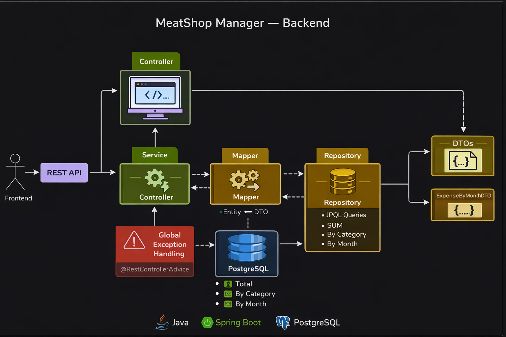
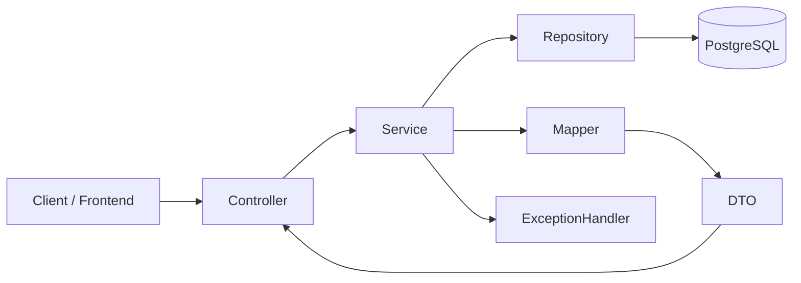

# 🥩 MeatShop Manager — Backend

Sistema backend para gerenciamento de despesas de um açougue, desenvolvido com foco em **arquitetura limpa**, **boas práticas** e **API REST profissional**, pronto para integração com qualquer frontend.

---

## Arquitetura do Sistema

---

## Tecnologias Utilizadas

---

## Diagrama Geral 

---

## 📊 Funcionalidades Implementadas

### CRUD de Despesas

* Criar despesa
* Listar despesas
* Buscar despesa por ID
* Atualizar despesa
* Remover despesa

### Dashboard Financeiro

* 💰 **Total gasto**
* 📦 **Total gasto por categoria**
* 📆 **Total gasto por mês (ano/mês)**

Os dados do dashboard são calculados diretamente no banco de dados utilizando **JPQL com `SUM` e `GROUP BY`**, garantindo melhor performance e menor acoplamento com o frontend.

---

